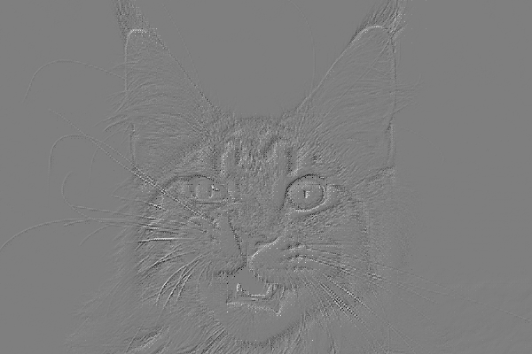
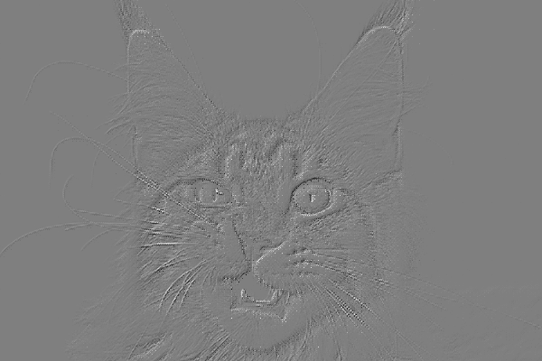
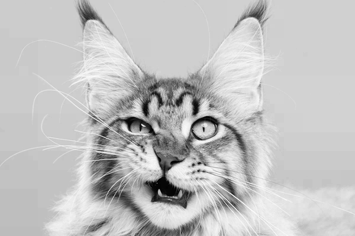
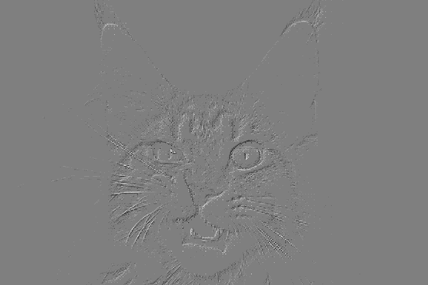
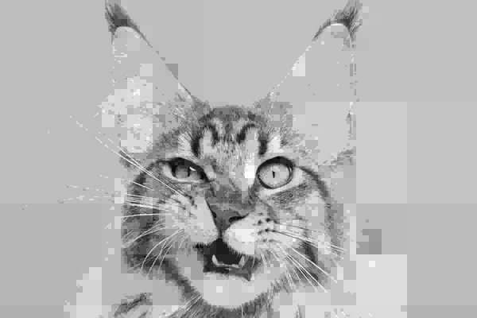

SpaceX Style Tensor Compression (XTensor)
========================================

This Repo is an example (or my interpretation) of the adaptive grid compression shown
in the following SpaceX video:

[[Youtube Video]](https://youtu.be/txk-VO1hzBY?t=941)  
[](https://youtu.be/txk-VO1hzBY?t=941)  

[xt.py](xt.py) runs the compression on a grayscale image [cat.jpg](cat.jpg) 
using nearest neighbor  (the video shows linear interpolation).

The trick to make this fast is using numpy's vectorized operations.
Anchor points can be selected by striding the input array in both dimensions. 
Then we can simply resize this anchor-point array back up to its original
size using the desired interpolation

```python
anchor = arr[::s, ::s]
n0, n1 = anchor.shape

interp = zoom(anchor[::2,::2], 2, order=order)[:n0,:n1]
```

Next we save the error values that exceed epsilon.

```python
error = anchor - interp

mask = np.abs(error) > epsilon
# Save error values that exceed epsilon
compressed[::s,::s][mask] = error[mask]
```

And then repeat with stride `s *= 2`

The result is a small set of anchor points, and the "compressed" image.
This result image resembles a gradient image in that the values shown
represent the areas of greatest change. In order to actually reduce the
memory footprint of the image, we can represent the image, which should contain
mostly zeros, as a sparse matrix. It appears that the SpaceX adaptive grid
uses a sparse representation similar to 'Dictionary of Keys' (DOK). Scipy has a 
dok_matrix type, but unfortunately it does not extend to N dimensional tensors/arrays.

*(Side Note: only nearest neighbor (order=0) works for this code.
A quick search shows that scipy.ndimage.zoom has several open issues on GitHub.
[scipy.zoom issues](https://github.com/scipy/scipy/issues/7324).
In order to make higher order interpolations work I need to adjust resize/zoom
so that original pixel values are preserved.)*


In short, the decompression works by interpolating between the anchor points,
and adding back the stored errors.

## Examples

### Input:  

### Compressed
* Epsilon = 0
* Non-zero = 62.04%



### Decompressed
  


### Compressed
* Epsilon = 2
* Non-zero = 40.00%




### Decompressed
  
*Notice the blocky background. This would be smooth if a higher order
interpolation was used*


### Compressed
* Epsilon = 25
* Non-zero = 6.61%




### Decompressed
  
